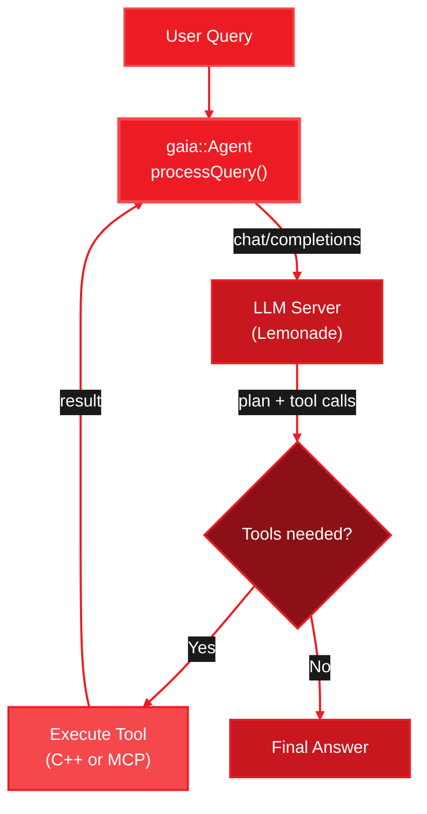
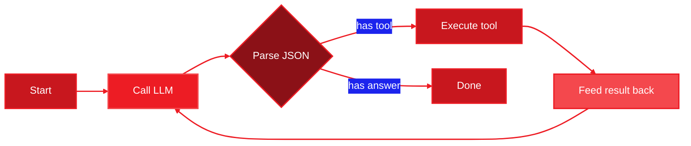
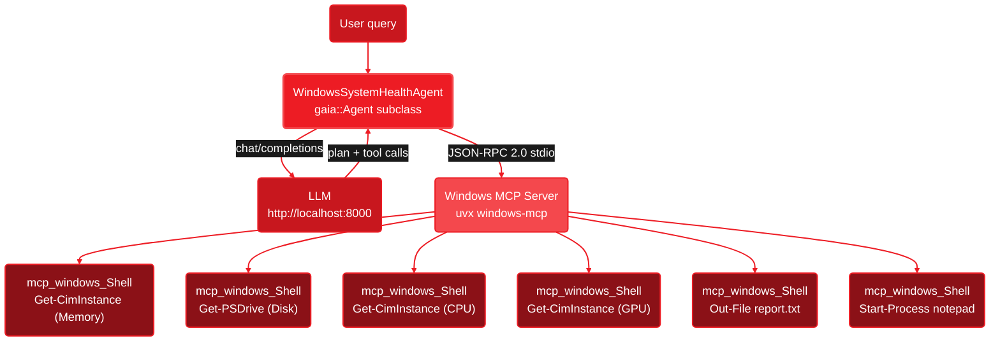

<Info>
  **Source Code:** [`cpp/`](https://github.com/amd/gaia/tree/main/cpp) in the GAIA repository.
</Info>

<Note>
**Component:** `gaia::Agent` base class and supporting libraries
**Language:** C++17
**Build system:** CMake 3.14+
**Dependencies:** nlohmann/json, cpp-httplib, Google Test (all fetched automatically)
</Note>

---

## Overview

The GAIA C++17 framework is a native implementation of the core agent system. It compiles to a standalone binary with no interpreter overhead or runtime dependencies.

**What it provides:**

- Agent execution loop with state machine (planning, tool execution, error recovery, completion)
- Multimodal queries — send text, images, or mixed content to vision-capable models
- Tool registry with `registerTool()` for defining agent capabilities
- MCP client with cross-platform stdio transport
- JSON response parsing with multi-strategy fallback (code-block extraction, bracket matching, syntax fixing)
- Console output with ANSI colors (`TerminalConsole`, `CleanConsole`) and silent mode (`SilentConsole`)

<Info>
The C++ framework focuses on the core agent loop and tool execution. Specialized agents (Code, Docker, Jira, Blender), the REST API server, RAG, and audio are available in the [Python SDK](/quickstart).
</Info>

---

## Agent Execution Flow



1. User query enters `agent.processQuery()`
2. Agent composes a system prompt (tool descriptions + response format) and sends it to the LLM via HTTP
3. LLM returns a JSON plan with tool calls
4. Agent executes each tool — either a locally registered C++ callback or a remote MCP tool via JSON-RPC 2.0 over stdio
5. Tool results feed back to the LLM for further reasoning
6. Loop repeats until the LLM produces a final answer or the step limit is reached

### Reactive Agent Loop

The agent is **not a script**. After every tool execution, the LLM is called again with the full conversation so far — including the tool's output. This lets the model reason about results and change course.



Each loop iteration: **LLM reasons → agent executes → result fed back → LLM reasons again**. The LLM can skip steps, add new ones, or pivot strategy at any point.

---

## How It Works

The `health_agent` demo is a [Windows System Health Agent](/guides/mcp/windows-system-health). It subclasses `gaia::Agent`, connects to the Windows MCP server on startup, then enters the planning loop.



### Wi-Fi Troubleshooter Demo

The `wifi_agent` demonstrates **adaptive reasoning** without MCP — all tools are registered directly in C++ as PowerShell commands. This showcases how an agent differs from a script: it reasons about each result, skips irrelevant steps, applies fixes, and verifies outcomes.

**Key features:**
- **Structured reasoning** — LLM outputs `FINDING:` and `DECISION:` prefixes, displayed with color-coded labels in the TUI
- **Adaptive behavior** — skips downstream checks if adapter is disconnected, adds fix/verify steps when issues are found
- **Real tools** — all diagnostics (`netsh`, `ipconfig`, `Test-NetConnection`) and fixes (`flush DNS`, `toggle Wi-Fi radio`, `restart adapter`) execute real PowerShell commands
- **GPU/NPU selection** — choose between GGUF (GPU) and FLM (NPU) model backends at startup
- **Admin detection** — warns on startup if fix tools won't work without elevation

See the [Wi-Fi Troubleshooter Agent guide](/cpp/wifi-agent) for a full walkthrough.

### How Tools Are Implemented

Tools are C++ lambdas registered with `ToolRegistry`. The Wi-Fi agent's tools wrap PowerShell commands via a `runShell()` helper that uses `_popen()` to spawn a PowerShell subprocess:

```cpp
// Simplified — each tool follows this pattern:
toolRegistry().registerTool(
    "check_adapter",                          // name the LLM sees
    "Check Wi-Fi adapter status and signal",  // description the LLM reads
    [](const gaia::json& args) -> gaia::json {
        std::string output = runShell("netsh wlan show interfaces");
        return {{"tool", "check_adapter"}, {"output", output}};
    },
    {}  // parameter schema
);
```

The agent itself is pure C++. PowerShell is just the shell subprocess that executes system commands (`netsh`, `ipconfig`, `Test-NetConnection`). For complex operations like the WinRT Radio API, the tool writes a temporary `.ps1` script and runs it via `powershell -File`.

### Structured Reasoning Display

The system prompt instructs the LLM to prefix its reasoning with `FINDING:` and `DECISION:`. The custom `CleanConsole` output handler parses these and displays them with color-coded labels:

- **Finding** (green) — what the diagnostic data shows
- **Decision** (yellow) — what the agent will do next and *why*

This is what distinguishes an agent from a script: the decision points are visible. When the agent skips a step ("adapter is disconnected — IP checks would fail"), applies a fix, or re-runs a diagnostic to verify, you can see the reasoning that drove that choice.

---

## Writing Your Own Agent

Subclass `gaia::Agent`, override `getSystemPrompt()` and optionally `registerTools()`, then call `init()` at the end of your constructor:

```cpp
#include <gaia/agent.h>

class MyAgent : public gaia::Agent {
public:
    MyAgent() : Agent(makeConfig()) {
        init();  // registers tools and composes system prompt
    }

protected:
    std::string getSystemPrompt() const override {
        return "You are a helpful assistant. Use tools to answer questions.";
    }

    void registerTools() override {
        toolRegistry().registerTool(
            "get_time",
            "Return the current UTC time.",
            [](const gaia::json&) -> gaia::json {
                return {{"time", "2026-02-24T00:00:00Z"}};
            },
            {}  // no parameters
        );
    }

private:
    static gaia::AgentConfig makeConfig() {
        gaia::AgentConfig cfg;
        cfg.maxSteps = 20;
        return cfg;
    }
};

int main() {
    MyAgent agent;
    auto result = agent.processQuery("What time is it?");
    std::cout << result["result"].get<std::string>() << std::endl;
}
```

### Multimodal Queries

To send images or mixed content to a vision-capable model, use the `processQuery(vector<MessageContent>)` overload:

```cpp
#include <gaia/agent.h>
#include <gaia/types.h>

class VisionAgent : public gaia::Agent {
public:
    VisionAgent() : Agent(makeConfig()) { init(); }

protected:
    std::string getSystemPrompt() const override {
        return "You are a vision assistant. Describe images clearly and concisely.";
    }

private:
    static gaia::AgentConfig makeConfig() {
        gaia::AgentConfig cfg;
        cfg.modelId = "Gemma-4-E4B-it-GGUF";  // vision-capable model
        return cfg;
    }
};

int main() {
    VisionAgent agent;

    auto result = agent.processQuery(
        std::vector<gaia::MessageContent>{
            gaia::TextContentBlock{"What do you see in this image?"},
            gaia::ImageURLContentBlock{gaia::ImageURL{
                "https://example.com/photo.jpg"
            }}
        }
    );

    std::cout << result["result"].get<std::string>() << std::endl;
}
```

<Note>
**Model requirement:** Multimodal queries require a vision-capable model (e.g., Gemma-4, Qwen3-VL). Text-only models will return an error when receiving image content.
</Note>

The content types available:

| Type | Header | Description |
|------|--------|-------------|
| `TextContentBlock` | `<gaia/types.h>` | Plain text content |
| `ImageURLContentBlock` | `<gaia/types.h>` | Image from a URL, with optional `detail` setting (`"auto"`, `"low"`, `"high"`) |

```cpp
// Image with high-detail processing
gaia::ImageURLContentBlock{gaia::ImageURL{
    "https://example.com/chart.png", "high"
}}
```

<Note>
**Why `init()` in the constructor?** C++ virtual dispatch does not work from base-class constructors. Calling `init()` at the end of your subclass constructor ensures `registerTools()` and `getSystemPrompt()` resolve to your overrides.
</Note>

### Connecting MCP Servers

Register all tools exposed by an MCP server with a single call:

```cpp
agent.connectMcpServer("my_server", {
    {"command", "uvx"},
    {"args", {"my-mcp-package"}}
});
// Tools are available as mcp_my_server_<tool_name>
```

---

## AgentConfig Reference

All fields have sensible defaults. Override only what you need:

```cpp
gaia::AgentConfig config;
config.baseUrl = "http://localhost:8000/api/v1";
config.maxSteps = 30;
config.debug = true;
```

| Field | Type | Default | Description |
|-------|------|---------|-------------|
| `baseUrl` | `std::string` | `"http://localhost:8000/api/v1"` | LLM server endpoint ([Lemonade Server](https://lemonade-server.ai) recommended; other OpenAI-compatible servers untested) |
| `modelId` | `std::string` | `"Qwen3-4B-GGUF"` | Model identifier sent to the server |
| `maxSteps` | `int` | `20` | Maximum agent loop iterations per query |
| `maxPlanIterations` | `int` | `3` | Maximum plan/replan cycles before forcing completion |
| `maxConsecutiveRepeats` | `int` | `4` | Consecutive identical responses before loop-detection triggers |
| `maxHistoryMessages` | `int` | `40` | Max messages kept between queries (0 = unlimited) |
| `contextSize` | `int` | `16384` | LLM context window size in tokens (`n_ctx`) |
| `debug` | `bool` | `false` | Enable verbose debug logging to stdout |
| `showPrompts` | `bool` | `false` | Print full system prompts and LLM responses |
| `silentMode` | `bool` | `false` | Suppress all console output (use `SilentConsole`) |
| `streaming` | `bool` | `false` | Enable streaming responses from the LLM — implemented via `LemonadeClient::chatCompletionsStreaming()` + `SseParser` |
| `temperature` | `double` | `0.7` | LLM sampling temperature (`0.0` = deterministic, `1.0` = creative) |

---

## Project Structure

```
cpp/
  CMakeLists.txt            # Build config (fetches all dependencies)
  include/gaia/
    agent.h                 # Core Agent class (processQuery, MCP connect)
    types.h                 # AgentConfig, Message, MessageContent, ImageURL, ToolInfo, ParsedResponse
    tool_registry.h         # Tool registration and execution
    mcp_client.h            # MCP JSON-RPC client (stdio transport)
    json_utils.h            # JSON extraction with multi-strategy fallback
    console.h               # TerminalConsole / SilentConsole output handlers
    clean_console.h         # CleanConsole — polished TUI with colors and word-wrap
  src/
    agent.cpp               # Agent loop state machine
    tool_registry.cpp
    mcp_client.cpp          # Cross-platform subprocess + pipes
    json_utils.cpp
    console.cpp
    clean_console.cpp
  examples/
    health_agent.cpp        # Windows System Health Agent (MCP demo)
    wifi_agent.cpp          # Wi-Fi Troubleshooter Agent (registered tools)
  tests/
    test_agent.cpp
    test_tool_registry.cpp
    test_json_utils.cpp
    test_mcp_client.cpp
    test_console.cpp
    test_clean_console.cpp
    test_tool_integration.cpp
    test_types.cpp
    integration/
      test_main.cpp
      test_integration_llm.cpp
      test_integration_mcp.cpp
      test_integration_wifi.cpp
      test_integration_health.cpp
  cmake/
    gaia_coreConfig.cmake.in  # Package config for find_package consumers
```

---

## Comparison with GAIA Python SDK

| Feature | Python | C++ |
|---------|--------|-------|
| Agent loop (plan, tool, answer) | Yes | Yes |
| Tool registration | Yes | Yes |
| MCP client (stdio) | Yes | Yes |
| JSON parsing with fallbacks | Yes | Yes |
| OpenAI-compatible LLM backend | Yes | Yes |
| Multimodal queries (text + images) | Yes | Yes |
| Multiple LLM providers (Claude, OpenAI) | Yes | Planned |
| Specialized agents (Code, Docker, Jira) | Yes | — |
| REST API server | Yes | — |
| Audio / RAG / Stable Diffusion | Yes | — |

---

## Next Steps

<CardGroup cols={2}>
  <Card title="Setup" icon="wrench" href="/cpp/setup">
    Install CMake, a C++17 compiler, Git, and Lemonade Server
  </Card>

  <Card title="Quickstart" icon="rocket" href="/cpp/quickstart">
    Build steps and running your first demo agent
  </Card>

  <Card title="API Reference" icon="book" href="/cpp/api-reference">
    Error handling, thread safety, security, deployment, and complete class API
  </Card>

  <Card title="Integration Guide" icon="puzzle-piece" href="/cpp/integration">
    Consume gaia_core in your own CMake project via FetchContent, find_package, or shared library
  </Card>

  <Card title="Custom Agent" icon="sliders" href="/cpp/custom-agent">
    Custom prompts, typed tools, MCP servers, output capture, and AgentConfig tuning
  </Card>
</CardGroup>

---

<small style="color: #666;">

**License**

Copyright(C) 2025-2026 Advanced Micro Devices, Inc. All rights reserved.

SPDX-License-Identifier: MIT

</small>
